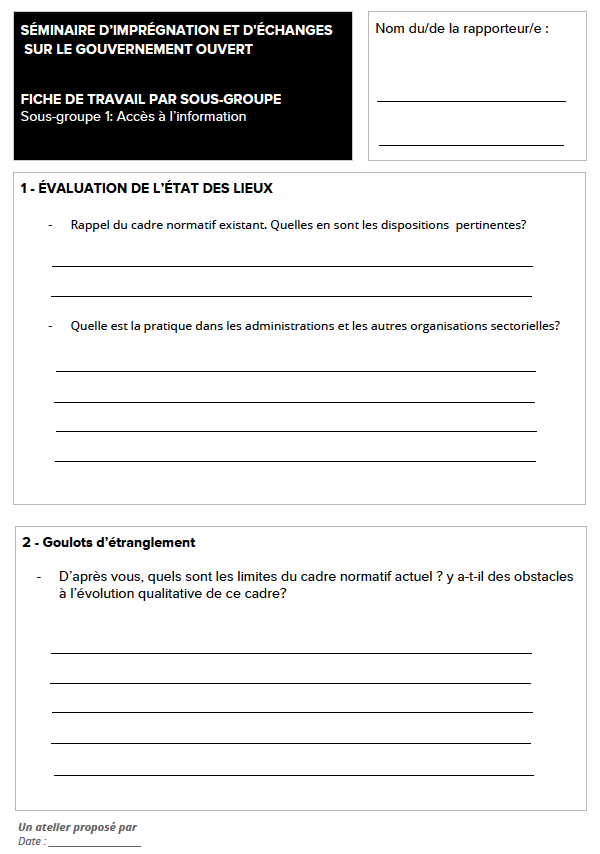

---
# Page settings
layout: ressources-single # Choose layout: "default", "homepage" or "documentation-archive"
title: Animer des ateliers de sensibilisation ou d'écriture d'engagements # Define a title of your page
description: Si vous souhaitez organiser et animer des ateliers de sensibilisation et de mobilisation autour du gouvernement ouvert et à l’adhésion au PGO, ou pour co-construire et co-rédiger des engagements du Plan d’Action National, voici quelques ressources, trames d’atelier et supports d'animation qui pourront vous être utile. # Define a description of your page
keywords: # Define keywords for search engines
order: 6 # Define order of this page in list of all documentation documents

# Hero section
hero:
    title: Animer des ateliers de sensibilisation au gouvernement ouvert ou d'écriture d'engagements
    text:  Si vous souhaitez organiser et animer des ateliers de sensibilisation, mobiliser autour du gouvernement ouvert et sur l’adhésion au PGO, ou pour co-construire et co-rédiger des engagements du Plan d’Action National, voici quelques ressources, trames d’atelier et supports d'animation qui pourront vous être utile. Ces ressources sont librement réutilisables, et téléchargeables.
 
---

## Ressources pratiques pour animer des ateliers 

### Organiser un séminaire d'imprégnation et d'échanges sur le gouvernement ouvert 

Si vous souhaitez vulgariser la notion et les principes de la gouvernance ouverte, mobiliser les acteurs autour de réflexions concrètes afin d'effectuer un plaidoyer en faveur du gouvernement ouvert, vous pouvez organiser un atelier collaboratif où les participants formeront des petits groupes de travail. 

#### Méthodologie

La fiche d'animation proposée ici prévoit que chaque groupe de travail puisse : 

* faire un état des lieux sur le gouvernement ouvert (en incluant les acquis à capitaliser, les pratiques observables, les goulots d’étranglement, etc...) ; 
* identifier et mettre en exergue les expériences et les cas de bonnes 
pratiques connues en Afrique francophone ; 
* identifier et proposer des actions envisageables à court et à long terme, ainsi que les principaux acteurs impliqués et la méthode à adopter. 

